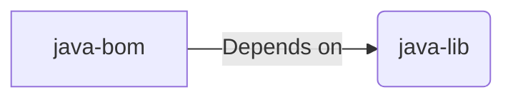

# Java® Libraries

Multi-module project with libraries for Java® and frameworks.

## Avaiable libraries

- [exception](./exception/README.md): common exceptions definitons.
- [logging](./logging/README.md): logs with best practices.
- [spring-boot-app](./spring-boot-app/README.md): reduce spring boot boilerplate.
- [spring-boot-rest-api-security](./spring-boot-rest-api-security/README.md): to create protected Rest APIs with JWT and RBAC.
- [spring-boot-rest-client-feign-security](./spring-boot-rest-client-feign-security/README.md): to create Rest API Clients to consume using Client Credentials
- [spring-boot-web](./spring-boot-web/README.md): Controller Advice for standard error handling
using the [exceptions](./exception/README.md), translating then to properly HTTP code
and CORS.

## Shoji

> [See how to use](./spring-boot-web/)

## Relation with [java-bom](TODO:)

